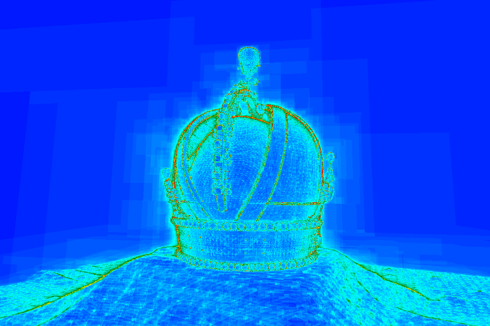

# Hagrid

This project is an implementation of the paper: _GPU Ray Tracing using Irregular Grids_.
This is not the version that has been used in the paper.

## Changes

Some improvements have been made to the construction algorithm, which change the performance characteristics of the structure:

- The voxel map can have more than two levels.
- Construction is faster (~ +33%)
- Memory consumption is lower (~ -20%)
- Traversal is slower (~ -5%)

The traversal being slower can easily being remedied by increasing the resolution (the default parameters are the parameters used in the paper, which will result in lower performance than what was reported for the reasons above). The improvements in build times and memory consumption more than compensate the loss in traversal performance. As a recommendation, use `--top-density 0.15 --snd-density 3.0` if you want to get approximately the same performance as the original paper. Increasing the resolution further will result in higher performance, and the new voxel map structure should prevent the memory usage from exploding.

Another option is to use the slower but more precise expansion algorithm, which can be enabled in [src/expand.cu](src/expand.cu#L159) by setting the `subset_only` variable to false. This algorithm is slower than the simpler subset expansion algorithm, but it will give a significant performance boost.

## Building

This project requires CUDA, SDL2, and CMake. Use the following commands to build the project:

    mkdir build
    cd build
    cmake-gui ..
    make -j

## Testing and Benchmarking

Once built, the project provides a library for traversal, a library for the construction, and a test/benchmark executable. The executable uses command line arguments to specify the scene to use. The scene must be in the OBJ format. Here is a list of typical uses of the command line program:

- Lists options:

      src/hagrid

- Loads the file `scene.obj`, builds an irregular grid using default parameters and display an interactive view:

      src/hagrid scene.obj
    
- Loads the file `scene.obj`, builds an irregular grid with top-level density 0.12, second-level density 0.24, alpha 0.995 (threshold to control cell merging---see the paper), 3 expansion passes, and display an interactive view:

      src/hagrid scene.obj --top-density 0.12 --snd-density 2.4 --alpha 0.995 --expansion 3
    
- Loads the file `scene.obj`, benchmarks the construction with default parameters by running 10 construction iterations and 5 warmup construction iterations and keeps intermediate buffers alive (should be preferred when benchmarking construction times), and finally display an interactive view:

      src/hagrid scene.obj --build-iter 10 --build-warmup 5 --keep-alive
      
- Loads the file `scene.obj`, builds an irregular grid with default parameters, and benchmark the traversal by running it on the given ray distribution (the file `distribution.rays`, containing each ray stored as 6 floats in binary format---3 for the origin and 3 for the direction) 100 times with 20 warmup iterations, and limit the distance along the ray to the range [0, 100]:

      src/hagrid scene.obj --ray-file distribution.rays --bench-iter 100 --bench-warmup 20 -tmin 0 -tmax 100

## License

The code is distributed under the MIT license (see [LICENSE.txt](LICENSE.txt)).
